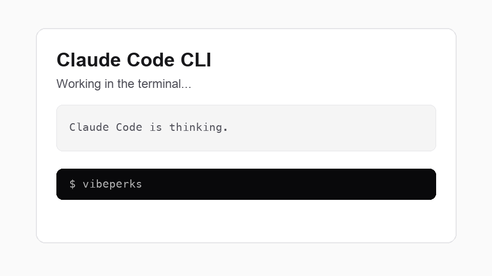
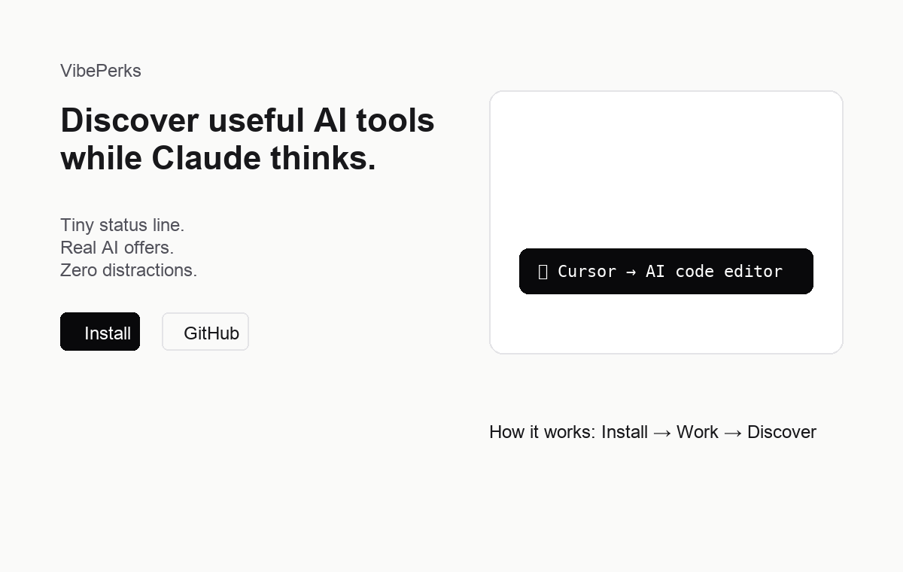
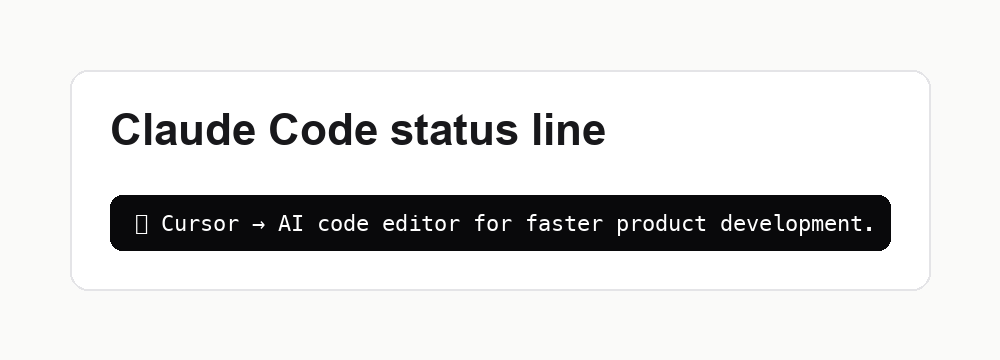

# VibePerks

VibePerks is a Vercel-ready Next.js project for showing useful AI-related perks to builders.



## Quick Start

```bash
npm install
npm run dev
```

Open `http://localhost:3000`.

## Screenshots





## Stack

- Next.js App Router
- TypeScript
- Tailwind CSS
- Supabase client
- ESLint
- Prettier
- Vercel-ready project structure

## Installation

Install dependencies:

```bash
npm install
```

## Environment

Create a local environment file:

```bash
cp .env.example .env.local
```

Fill in Supabase values:

```bash
NEXT_PUBLIC_SUPABASE_URL=https://your-project.supabase.co
NEXT_PUBLIC_SUPABASE_ANON_KEY=your-anon-key
```

## Development

Start the project:

```bash
npm run dev
```

Open:

- `http://localhost:3000`
- `http://localhost:3000/admin`

If port `3000` is busy, Next.js will print the next available local URL.

## Database

Database changes live in `supabase/migrations`.

The first migration creates the `offers` table:

```text
supabase/migrations/20260628220000_create_offers.sql
```

Run migrations with the Supabase CLI:

```bash
npx supabase db push
```

Seed test offers:

```bash
npx supabase db reset
```

The seed file is:

```text
supabase/seed.sql
```

## Checks

Run a production build:

```bash
npm run build
```

Run ESLint:

```bash
npm run lint
```

Run TypeScript checks:

```bash
npm run typecheck
```

Check formatting:

```bash
npm run format:check
```

## Architecture

- `app/` contains routes, pages, and server actions.
- `lib/offer-repository.ts` is the only layer that queries Supabase tables.
- `lib/supabase.ts` creates the Supabase client from shared config.
- `lib/config.ts` centralizes environment variables.
- `lib/api-response.ts` centralizes API success and error responses.
- `lib/logger.ts` centralizes logging for server-side code.
- `types/` contains shared TypeScript types.
- `packages/cli/` contains the VibePerks CLI and its CLI-specific config.

API routes should stay thin: call repositories, return shared response helpers,
and log unexpected errors through `logger`.

## API

The project includes these endpoints:

- `GET /api/offer`
- `POST /api/impression`
- `POST /api/click`

`GET /api/offer` returns one active offer from Supabase.

If there is no active offer, it returns `404`.

## Admin

Offers can be managed at `http://localhost:3000/admin/offers`.

## CLI Usage

Start the web app first:

```bash
npm run dev
```

Then run the CLI:

```bash
npm run cli
```

The CLI requests `GET /api/offer` and prints the active offer:

```text
🎁 Cursor → AI code editor for faster product development.
```

Use a custom API URL:

```bash
VIBEPERKS_API_URL=https://your-domain.com npm run cli
```

If the API is unavailable, the CLI prints nothing and exits without an error.

## Claude Code Integration

Claude Code supports a `statusLine` command in its settings. The command receives
Claude Code session data through stdin and displays whatever the command writes to
stdout.

Install dependencies:

```bash
npm install
```

Add this to your Claude Code settings:

```json
{
  "statusLine": {
    "type": "command",
    "command": "cd /path/to/vibeperks && VIBEPERKS_API_URL=http://localhost:3000 ./node_modules/.bin/vibeperks"
  }
}
```

For a deployed API:

```json
{
  "statusLine": {
    "type": "command",
    "command": "VIBEPERKS_API_URL=https://your-domain.com npx vibeperks"
  }
}
```

The status line output is compact:

```text
🎁 Cursor → AI code editor for faster product development.
```

## Project Structure

```text
/
  docs/
    MVP.md
  app/
    admin/
    api/
    globals.css
    layout.tsx
    page.tsx
  components/
  lib/
    api-response.ts
    config.ts
    logger.ts
    offer-repository.ts
    supabase.ts
  types/
    api.ts
    offer.ts
    index.ts
  public/
  packages/
    cli/
      src/
        config.js
        index.js
  supabase/
    migrations/
    seed.sql
  scripts/
  .env.example
  .eslintrc.json
  .gitignore
  .prettierrc
  next.config.mjs
  package.json
  postcss.config.mjs
  tailwind.config.ts
  tsconfig.json
```
